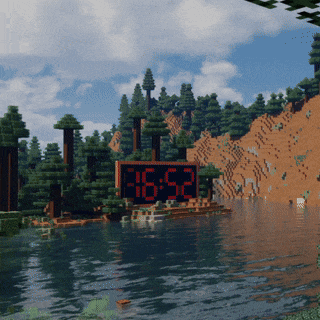

# WE-MC-DigitalClock



**WE-MC-DigitalClock** is an updated version of the **Minecraft Redstone Clock** wallpaper for Wallpaper Engine. This version includes improved video quality, piston sound effects, optional background sound, and dynamic weather-based background changes powered by the OpenWeatherMap API. It maintains the Minecraft-inspired digital clock within an animated environment.

## What's New in This Version?

- **Weather-Responsive Backgrounds**: With the OpenWeatherMap API, the wallpaper updates the background based on real-time weather conditions in your town, such as sunny, rainy, cloudy, or snowy weather.
- **Piston Sound Effects**: The clock now includes piston sounds every time the clock changes, enhancing the Minecraft redstone effect.
- **Optional Background Sound**: Add your own ambient background audio in `.ogg` format for a richer experience.
- **Improved Video Quality**: New video encoding method.
  
## Features

- **Minecraft-Themed Digital Clock**: Displays the current time inside a Minecraft world, with time-based visual transitions.
- **Dynamic Background**: The wallpaper automatically switches between different backgrounds depending on the time of day (morning, afternoon, evening, night).
- **Weather-Based Animations**: Sync the wallpaper with real-world weather using the [OpenWeatherMap API](https://openweathermap.org/).
- **Sound Effects**:
  - **Piston Sound**: Included by default. Plays every time the clock changes.
  - **Background Sound**: Optional. Users can add their own background audio file in `.ogg` format.
- **Customizable Weather for Your Town**: Set your location to get current weather.

## Setup Guide

### Requirements

1. [Wallpaper Engine](https://store.steampowered.com/app/431960/Wallpaper_Engine/).
2. A [free OpenWeatherMap API key](https://openweathermap.org/api).
3. Background sound file in `.ogg` format (optional).

### Adding Background Sound

> **Note**: Piston sound effects are included by default, but the background sound is not. You will need to provide your own background sound file.

To add your own custom background audio, you need an audio file in `.ogg` format:

1. Find or convert your preferred background sound to `.ogg` format (you can use an online converter if necessary).
2. Place the `.ogg` file in the following directory inside the wallpaper folder:
   ```bash
   /resources/sound/backgroundAudio.ogg
4. The sound will automatically play as background audio when the wallpaper is active. Volumen can be changed in settings.

### Enabling Weather API Integration

1. Get an API key from OpenWeatherMap.
2. In the Wallpaper Engine wallpaper settings, enable the wallpaper, copy the API, and set the town. (The wallpaper updates the weather every 3 minutes.)

### Customization

In Wallpaper Engine's wallpaper settings, you can set different background animations based on the weather and time. If you set it to cycle, it will automatically change according to the time of day.

### Installation

1. Download or clone the wallpaper:
   ```bash
   git clone https://github.com/blazjerman/WE-MC-DigitalClock.git
2. Alternatively, you can get the wallpaper directly from Steam Workshop at the following link:
https://steamcommunity.com/sharedfiles/filedetails/?id=1731760875


   
